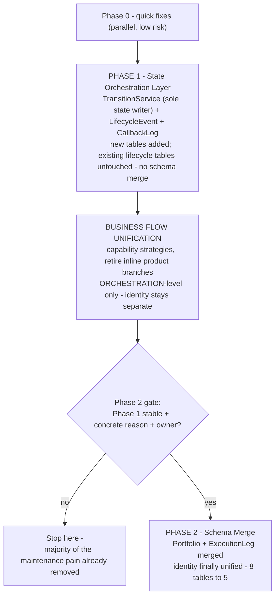

---
pdf_options:
  format: A4
  margin: 15mm 13mm
  printBackground: true
  displayHeaderFooter: true
  headerTemplate: "<div style='font-size:8px;width:100%;text-align:center;color:#888;'>YouTrade — Portfolio &amp; Business-Flow Unification — Implementation Plan v1</div>"
  footerTemplate: "<div style='font-size:8px;width:100%;text-align:center;color:#888;'>Page <span class='pageNumber'></span> / <span class='totalPages'></span></div>"
css: |
  body { font-family: Helvetica, Arial, sans-serif; font-size: 10.3px; color:#1a1a1a; line-height:1.42; }
  h1 { color:#0A2540; font-size:21px; margin-bottom:2px; }
  h2 { color:#0A2540; font-size:14px; border-bottom:2px solid #5B7C99; padding-bottom:3px; margin-top:22px; }
  h3 { color:#0A2540; font-size:11.5px; margin-top:14px; margin-bottom:2px; }
  h4 { color:#33414d; font-size:10.5px; margin-top:10px; margin-bottom:1px; }
  table { border-collapse: collapse; width:100%; font-size:9px; margin-top:5px; }
  th,td { border:1px solid #c5d0da; padding:3px 6px; text-align:left; vertical-align:top; }
  th { background:#0A2540; color:#fff; }
  tr:nth-child(even) { background:#f3f6f9; }
  code { background:#eef2f6; padding:1px 3px; border-radius:3px; font-size:8.6px; }
  pre { background:#f3f6f9; border:1px solid #c5d0da; padding:6px 8px; font-size:8.4px; overflow-x:auto; line-height:1.35; }
  img { max-width:100%; }
  .new { color:#C77C00; font-weight:bold; }
  .meta { color:#5B7C99; font-size:9.3px; }
  .uc { font-style:italic; color:#33414d; }
  .ok { color:#1a7f37; font-weight:bold; }
  .no { color:#b3261e; font-weight:bold; }
  blockquote { border-left:3px solid #5B7C99; margin:6px 0; padding:2px 10px; background:#f3f6f9; color:#33414d; }
---

# YouTrade — User-Portfolio & Business-Flow Unification
## Implementation Plan v1

<p class="meta">Scope: <code>user-portfolio-service</code>, <code>rebalancing-business-service</code>, <code>user-portfolio-business-service</code>. A buildable, phased plan to remediate the lifecycle architecture and unify the MTF/Equity business flows. Conclusions locked across an eight-round AK ⇄ Codex architecture review. This document is written for the engineering team that will implement it.</p>

---

## 1. How to read this document

This plan is delivered in **three workstreams that must be executed in this order**:

> **Phase 1 (lifecycle remediation) → Business-flow unification → Phase 2 (lifecycle schema merge).**

| Convention | Meaning |
|---|---|
| **Implementation-grade** | Sections 7, 8, 9 — concrete enough to build from (schemas, interfaces, steps). |
| **Decision context** | Sections 1–6 — why the plan is shaped this way; read once, then refer back. |
| **Compatibility rule** | **No client-facing breakage without a migration path.** Every endpoint/contract change ships behind a deprecation window. |
| **Source of truth** | After Phase 1, lifecycle **state** has exactly one writer (`TransitionService`) and one history (`LifecycleEvent`). Treat any other state write as a bug. |

The two product flows referenced throughout — **"rebalance / equity"** and **"basket / onetime (MTF, Intraday)"** — are described in full in §3. Engineers should read §3 before §7.

---

## 2. Purpose, scope and the decision

### 2.1 Purpose
`user-portfolio-service` runs **two parallel lifecycle architectures** for what is conceptually one thing — a user's portfolio moving through its life — and the business services expose **partly-duplicated MTF vs Equity endpoints**. This plan fixes both, pragmatically and in phases.

### 2.2 The decision behind the plan
A full **config-driven v2 lifecycle engine** was designed and then **deliberately shelved** — the team could not commit to ≥2 serious new lifecycles on the roadmap, a dedicated platform owner, or operating "config-as-data" with discipline. Building it speculatively would be over-engineering. This plan is the **pragmatic alternative**: plain Django + plain Python, no engine.

> **Locked principle:** the biggest defect is **not** table count — it is **uncontrolled state mutation and implicit signal side-effects**. Therefore: build a state-orchestration layer over the existing schemas **first** (Phase 1); unify the business flows at the **orchestration level** next; merge the schemas **last** and only if a gate is met (Phase 2).

### 2.3 In scope / out of scope

| In scope | Out of scope |
|---|---|
| `user-portfolio-service` — lifecycle models, state, signals | The shelved v2 config engine (separate doc, reference only) |
| `rebalancing-business-service` — order/rebalance/MTF endpoints | `portfolio-business-service` **as an execution owner** — it is the catalogue/model bounded context and stays out (see §8.7) |
| `user-portfolio-business-service` — product wrappers, endpoints | `holdings` (`apps/holdings`) — stays a separate aggregate the lifecycle *emits to* |
| The MTF ⇄ Equity business-flow duplication | Broker adapters / `trade-placement` internals |

### 2.4 Non-goals
- Not a rewrite. Legacy keeps running and earning throughout.
- Not a single "common endpoint for everything" — that is explicitly rejected (§8).
- Phase 2 may never execute; that is an acceptable outcome.

---

## 3. Current system reference — the two flows

<p class="uc">Engineers: read this section fully. Both flows live in <code>repos/user-portfolio-service/apps/portfolio/</code>. The business endpoints live in the three FastAPI services.</p>

### 3.1 Flow A — User-portfolio / rebalance (equity)

A user subscribes to a model portfolio, invests, and the advisor rebalances it periodically. **4-tier hierarchy:**

```
UserPortfolio                 container — status, strategy, product_type
  └─ UserPortfolioRebalance    a rebalance EVENT — type, current_state (States), states[]
       └─ PortfolioRebalanceTransaction   a PHASE — type (initial/t0/t1/cash_allocation), current_state
            └─ UserInstruction            a LEG — symbol, side, status, trade_placement_id
       └─ PhaseCallbackLog     sell→buy phase handoff log
```

- **`t0` / `t1` are real lifecycle phases**, not cosmetic: `t0` = the SELL batch, `t1` = the BUY batch. Sequencing, callbacks and completion depend on them. **Do not flatten them into a generic "rebalance" status.**
- **`cash_ingested` is phase-sensitive** — its sign carries meaning. A withdrawal and an additional investment are **not** the same; do not treat them alike.
- State enums: `States` (pending/partial/complete) for the event; `RebalanceTransactionStates` (processing/partially_completed/retry_enabled/completed/manually_completed/skipped) for the phase; `OrderStatus` for the leg.
- The flow used for `equity` `product_type` (and MTF rebalance variants).

### 3.2 Flow B — Basket / onetime (MTF, Intraday)

A user pays for a basket, it is bought once, then each position is monitored for stop-loss / profit-target, then exited. **3-tier hierarchy:**

```
Basket                         container — current_state (BasketStates), model_id, payment_id, profit_target_1/2
  └─ Order                     one monitored position — current_status (OrderCurrentStatus 8 states), states[], stop_loss, leverage
       └─ OrderInstruction     a LEG — symbol, side, status, trade_placement_id
```

- **`basket_id` is the lifecycle anchor** for this flow. Entry, retry, skip, exit and order-status are all basket-shaped. **Do not casually map `basket_id` to `user_portfolio_rebalance_id` — they are different things.**
- `MonitoredOrder`/`Order` carries SL/leverage; **profit-targets are basket-level** (on `Basket`).
- State enums: `BasketStates` (uninvested/waiting/monitoring/complete); `OrderCurrentStatus` (waiting/buy_in_progress/sell_in_progress/buy/sl_waiting/sl_placed/sell/skip); `OrderStatus` for the leg.

### 3.3 How the two flows are chained today

A completed `UserPortfolioRebalance` (state → `complete`) fires a Django `post_save` signal that calls `services/rebalance_to_basket.create_basket_from_rebalance()`, which spawns a `monitoring` `Basket` + `Order`s + `OrderInstruction`s. **This coupling is invisible at the call site** and is a primary source of drift.

### 3.4 The instruction is the execution unit in BOTH flows

`UserInstruction` (Flow A) and `OrderInstruction` (Flow B) are the same concept — one trade leg sent to the broker — **but they are stored in different tables with divergent code.** This is *why* orchestration can be unified before the schema is (§8), but identity cannot be unified until Phase 2.

### 3.5 Current endpoint inventory (business services)

**`rebalancing-business-service`** — `app.py` (28 endpoints, equity/rebalance-shaped) + a **separate MTF router** `framework/routers/mtf.py` (basket-shaped):

| Operation | Equity / rebalance route (`app.py`) | MTF route (`mtf.py`) |
|---|---|---|
| Allocation / details | `POST /details` | `POST /orders/details/` |
| Place orders | `POST /orders` | `POST /orders/entry/basket` |
| Order details | `GET /orders/details` | (in `/orders/details/`) |
| Retry | `POST /orders/retry` | `POST /orders/retry/basket/{basket_id}` |
| Skip | — | `POST /orders/skip/basket/{basket_id}` |
| Exit / withdraw | `POST /withdrawal/orders` | `POST /orders/exit/basket` |
| List | `GET /orders/details` | `GET /baskets/{basket_id}/orders` |
| Rebalance-only | `/cash/allocation`, `/investment/rebalance`, `/complete`, `/callback/trade/actions` | — |
| Holdings | `/user/holding/verify`, `/reconcile`, `/authorize` — **already polymorphic** via `Product.get_product_class()` | (shared) |

**`user-portfolio-business-service`** — 20 endpoints, not URL-split by product; product handled via `wrappers/` (`product.py` + `mtf.py`/`equity.py`/`intraday.py`) plus inline `if product == MTF` branches.

**`portfolio-business-service`** — catalogue / model-portfolio context; `product_type` is a query param.

### 3.6 State-name warning

`BasketStates` and `RebalanceTransactionStates`/`States` **look similar but mean different things** (`complete`, `partial`, etc. recur with different semantics). **Never infer equivalence from string names.** An explicit mapping table is required — see §7.5.

---

## 4. Legacy problems (evidence-backed)

<p class="uc">All verified by grep/read against the repo. Paths under <code>user-portfolio-service/apps/portfolio/</code> unless noted.</p>

| # | Problem | Evidence |
|---|---|---|
| A1 | Two parallel lifecycle architectures for one concept. | `models/` — 8 model files |
| A2 | `UserInstruction` ≈ `OrderInstruction` — near-duplicate models. | `user_instruction.py`, `order_instructions.py` |
| A3 | The two architectures coupled by a hidden `post_save` signal. | `signals.py` → `rebalance_to_basket.py` |
| A4 | Five overlapping, inconsistent state vocabularies. | `constants.py` |
| B1 | **No single transition authority** — direct `current_state =` writes in **24 places across 7 files**. | `services/`, `apis/`, `signals.py` |
| B2 | **Seven `post_save` signals** run business logic; a `.save()` triggers a hidden cascade. | `signals.py:30,54,119,163,195,237,266` |
| B3 | Re-entrant cascade — `order_instruction_save` calls `order.save()` twice → re-fires `orders_save` → basket save → order creation. | `signals.py:195-230` |
| B4 | One signal does holdings updates + async task + `serializer.save()` + aggregations; untestable, unclear transaction boundary. | `signals.py:54-115` |
| B5 | `states[]` ArrayField is the only history — no timestamp/actor/reason. | `orders.py:44`, `user_portfolio_rebalance.py:31` |
| B6 | Lifecycle flow hidden in `if/elif` chains + hardcoded `REBALANCE_MAPPING`. | `services/rebalance_transaction.py`, `constants.py` |
| B7 | No idempotency on broker callbacks — duplicate callback processed twice. | callback path |
| C1 | Five mutable field defaults (`default={}` / `default=[]`). | `orders.py:44`; `portfolio_rebealnce_transaction.py:24,25`; `user_portfolio_rebalance.py:33,38` |
| C2 | `Basket.end_amount` is a `CharField` holding money. | `models/basket.py` |
| C3 | `UserPortfolio` unique constraint commented out (migration 0059). | `user_portfolio.py:19-22` |
| C4 | 66 migrations on one app — heavy ad-hoc churn. | `migrations/` |
| D1 | N+1 / nested loops in model properties (`average_leverage` triple-nested). | `models/user_portfolio.py` |
| D2 | Business logic scattered across model properties, signals and services. | app-wide |
| E1 | Business services half-migrated — three coexisting styles for product dispatch: separate MTF router, inline `if product==mtf`, polymorphic `get_product_class()`. | §3.5 |
| E2 | `Product` ABC is **weak** — no abstract methods, just a factory + helpers; not a real capability contract. | `rebalancing-business-service/services/product.py:10`, `user-portfolio-business-service/wrappers/product.py:18` |

---

## 5. Target architecture & sequencing

Three layers, fixed in three workstreams, in this order:




**Source-of-truth rules (apply from Phase 1 onward):**
- Lifecycle **state** — the legacy fields `current_state`, `current_status`, **and lifecycle-significant instruction `status`** — is written **only** by `TransitionService`.
- Lifecycle **history** → `LifecycleEvent` (append-only) is authoritative; `states[]` becomes read-only legacy.
- Lifecycle **execution facts** (fills) → the leg/instruction rows; broker callbacks flow through `TransitionService`.
- **Service ownership:** `user-portfolio-service` owns lifecycle state; the business services own *orchestration and product strategy*; `portfolio-business-service` owns catalogue/model data only.

---

## 6. Phase 0 — quick fixes

<p class="uc">Independent, low-risk, ship in parallel with Phase 1 prep. No large behaviour change.</p>

| Problem | Fix |
|---|---|
| C1 mutable defaults | `default={}` → `default=dict`; `default=[]` → `default=list`. |
| C2 money as text | `Basket.end_amount` `CharField` → **`DecimalField`**; data-migrate. |
| C3 missing constraint | De-duplicate rows, re-add `unique_user_subscription`. |
| B7 (prep) | Introduce a `CallbackLog` table early if cheap — it is needed by Phase 1 anyway. |
| D2 (prep) | Add correlation IDs + structured logging around state writes, so Phase 1 can measure parity. |
| Cleanup | Remove commented-out code; lift `created_str`/`modified_str` into a mixin; document the `order_tag` uniqueness rule and align both models. *(The `portfolio_rebealnce_transaction.py` filename typo is **not** a Phase 0 item — it touches imports and migration references; track it as a separate, carefully-handled change.)* |

---

## 7. PHASE 1 — State Orchestration Layer

<p class="uc">Goal: one writer of state, one real history, idempotent callbacks — over BOTH existing schemas, with NO schema merge. This is where the maintenance pain actually goes away. Both flows are covered.</p>

### 7.1 What gets built

| Component | Role | Replaces |
|---|---|---|
| `TransitionService` | The **sole** writer of lifecycle state. | 24 scattered `current_state =` writes |
| `LifecycleEvent` (table) | Append-only history — timestamp, actor, trigger, from/to state, reason. | `states[]` ArrayField |
| `CallbackLog` (table) + idempotency | Records broker/async callbacks; a duplicate is a no-op. | `PhaseCallbackLog` (generalised) |
| `transitions` module (`ALLOWED`) | The whole lifecycle as one tested matrix. | `if/elif` chains + `REBALANCE_MAPPING` |

No existing lifecycle tables are merged or replaced — Phase 1 only **adds** `LifecycleEvent` and `CallbackLog`. `TransitionService` addresses the **existing** models through a polymorphic reference (`stage_type` + `stage_id`), so one service serves both hierarchies. The `ALLOWED` matrix is keyed by `stage_type` (`portfolio` / `rebalance_event` / `phase` / `order` / `basket`) — **both flows are handled by one authority even though the tables stay separate.** Because the legacy models do not share a state field name (`Order` uses `current_status`, others use `current_state`), `TransitionService` reaches state only through the **Stage Adapter** (§7.5) — never a hardcoded attribute.

### 7.2 `LifecycleEvent` — schema

| Column | Type | Purpose |
|---|---|---|
| `id` | BigAutoField PK | Identity / ordering. |
| `stage_type` | CharField | `portfolio` / `rebalance_event` / `phase` / `order` / `basket` — which legacy entity. |
| `stage_id` | BigInteger | PK of that legacy row (polymorphic reference). |
| `event_type` | CharField | `created` / `state_changed` / `transition_applied` / `guard_failed` / `leg_updated` / `error`. |
| `from_state` | CharField, null | State before. |
| `to_state` | CharField, null | State after. |
| `actor` | CharField | User id / service name / `system`. |
| `trigger` | CharField | `api` / `callback` / `scheduled` / `manual` / `system`. |
| `guard_code` | CharField, null | Guard that passed/failed. |
| `idempotency_key` | CharField, **indexed (not unique)**, null | Correlates events to a callback. One callback may legitimately emit several events, so uniqueness lives on `CallbackLog`, not here. If a unique guard is wanted, use the composite `(idempotency_key, stage_type, stage_id, event_type)`. |
| `correlation_id` | CharField, indexed, null | Cross-service request trace. |
| `payload` | JSONField, `default=dict` | Raw context — callback body, broker ref, error detail. |
| `occurred_at` | DateTimeField, auto | Event time. Append-only — rows never updated/deleted. |

<p class="uc">Required indexes: <code>(stage_type, stage_id, occurred_at)</code>, <code>(correlation_id)</code>, <code>(idempotency_key)</code>.</p>

### 7.3 `CallbackLog` — schema

| Column | Type | Purpose |
|---|---|---|
| `id` | BigAutoField PK | Identity. |
| `stage_type`, `stage_id` | CharField, BigInteger | Polymorphic ref to the awaiting entity. |
| `callback_ref` | CharField, unique | External correlation id (was `PhaseCallbackLog.phase_id`). |
| `direction` | CharField | `inbound` / `outbound`. |
| `target_service` | CharField | Counterparty — `rebalancing-business-service`, `trade-placement`. |
| `status` | CharField | `processing` / `completed` / `failed`. |
| `idempotency_key` | CharField, unique | Duplicate-callback guard. |
| `request_payload`, `response_payload` | JSONField, `default=dict` | Audit. |
| `reason` | TextField, null | Failure detail. |
| `created`, `modified` | DateTimeField | Audit. |

<p class="uc">Required indexes: <code>(idempotency_key)</code> unique, <code>(callback_ref)</code> unique, <code>(stage_type, stage_id)</code>. <code>CallbackLog</code> — not <code>LifecycleEvent</code> — is the authoritative idempotency record for callbacks.</p>

### 7.4 `TransitionService` — contract

A proper, tested state module — **not** a loose dict. Enums for stage-type and state; a versioned `ALLOWED` matrix; guard functions; row-level locking; idempotency; event emission; side-effects deferred to commit. State is read/written **only** through the Stage Adapter (§7.5).

```python
# transitions.py — ILLUSTRATIVE EXCERPT ONLY.
# Completing ALLOWED for ALL stage types and ALL states — incl. basket states,
# retry / partial / manual-completion / skip / legal re-entry paths, both flows —
# is itself a Phase 1 deliverable. Do not treat the excerpt below as complete.
ALLOWED = {
    "rebalance_event": {"pending": ["partial", "complete"], "partial": ["complete"]},
    "phase":           {"processing": ["partially_completed", "completed",
                                       "retry_enabled", "manually_completed", "skipped"],
                        "retry_enabled": ["processing", "completed", "skipped"]},
    "basket":          {"uninvested": ["waiting"], "waiting": ["monitoring"],
                        "monitoring": ["complete"]},
    "order":           {"waiting": ["buy_in_progress", "skip"],
                        "buy_in_progress": ["buy"],
                        "buy": ["sl_waiting", "sell_in_progress"],
                        "sl_waiting": ["sl_placed"], "sl_placed": ["sell_in_progress"],
                        "sell_in_progress": ["sell"]},
    # "portfolio": { ... }  — to be completed
}

def transition(stage, to_state, *, actor, trigger, idempotency_key, guard_ctx=None):
    adapter = StageAdapter.for_type(stage.stage_type)        # §7.5 — resolves state field etc.
    with transaction.atomic():
        stage = adapter.lock_for_update(stage)               # row lock — serialise callbacks
        if CallbackLog.objects.filter(idempotency_key=idempotency_key,
                                       status="completed").exists():
            return stage                                     # duplicate callback — no-op
        from_state = adapter.get_state(stage)
        if to_state not in ALLOWED[stage.stage_type].get(from_state, []):
            raise IllegalTransition(stage, from_state, to_state)   # illegal move blocked
        run_guards(stage, to_state, guard_ctx)               # transition preconditions
        LifecycleEvent.objects.create(stage_type=stage.stage_type, stage_id=stage.id,
                                      event_type="state_changed", from_state=from_state,
                                      to_state=to_state, actor=actor, trigger=trigger,
                                      idempotency_key=idempotency_key)
        adapter.set_state(stage, to_state)                   # writes current_state OR current_status
        transaction.on_commit(lambda: schedule_side_effects(stage, to_state))
    return stage
```

**Mandatory properties:** row-locking (or optimistic versioning) so concurrent broker callbacks serialise; **side-effects run in `transaction.on_commit`**, never inside the mutation; the matrix is exhaustively unit-tested for every legal *and* illegal transition.

### 7.5 Stage Adapter contract (required deliverable)

The legacy models are not uniform — `Order` stores state in `current_status`, the others in `current_state`; each has its own state enum, parent lookup and side-effects. `TransitionService` must **never** touch a model attribute directly; it goes through a **Stage Adapter**, one per `stage_type`. Each adapter declares:

| Adapter field | Meaning |
|---|---|
| `stage_type` | `portfolio` / `rebalance_event` / `phase` / `order` / `basket` |
| `model` | the Django model class |
| `state_field` | `current_state` or `current_status` |
| `state_enum` | the allowed-states enum for this stage |
| `lock_for_update(stage)` | the `select_for_update()` query that row-locks it |
| `get_state(stage)` / `set_state(stage, value)` | read/write the state field uniformly |
| `parent(stage)` | the parent stage (phase→event, order→basket/portfolio) — or `None` |
| `side_effect_hooks` | the explicit service callables to run on entering a state (the re-homed signal logic, §7.8) |

Adapters are the seam that lets one `TransitionService` drive both flows without the schema being merged.

### 7.6 State mapping table (required deliverable)

Because the two flows have different state vocabularies, Phase 1 must ship an explicit mapping so `LifecycleEvent` and reporting are coherent. Example (to be finalised with the team):

| Concept | Flow A (rebalance) | Flow B (basket) |
|---|---|---|
| Not started | `pending` | `uninvested` / `waiting` |
| In progress | `partial` / phase `processing` | `buy_in_progress` / `sell_in_progress` |
| Active / holding | (between rebalances) | `monitoring` |
| Done | `complete` | `complete` / order `sell` / `skip` |

### 7.7 Idempotency key composition

Every callback carries a composite key — **broker + order_tag + trade_placement_id + broker_event_id + payload-hash**. `TransitionService` and `CallbackLog` both check it. A duplicate is a **no-op, not an error**.

### 7.8 Removing the 7 signals — safe 8-step order

Deleting signals naively drops side-effects silently — signals are an accidental backstop for admin saves, serializers, tasks and scripts.

1. Ship `LifecycleEvent` and `CallbackLog`.
2. Build an explicit service method for **each** behaviour a signal performs.
3. Point every API / callback / task / admin path at those service methods.
4. Temporarily leave each signal as a **thin adapter** that calls the same service method.
5. Add **parity tests** around every old signal behaviour.
6. Add logging/metrics for any direct model save still relying on a signal.
7. Disable signals behind a feature flag / staged deploy.
8. Delete a signal only once parity is proven in production.

**Behaviours that MUST be re-homed** (today hidden in `signals.py`): PRT creation → create `UserInstruction`s; PRT completion → update `UserPortfolioRebalance`; instruction fill → update holdings/cash; sell fill → enqueue `phase_detail_callback`; PRT `executed_list`/`amount` aggregation; `Basket` save → create/update `Order`s; `Order` save → create `OrderInstruction`s; `OrderInstruction` fill → update order price/amount/status; basket totals; cash-allocation `rebalance_id` copy; `UserPortfolio` save → `JobScheduler` call; **and the `rebalance_to_basket` handoff** (becomes an explicit transition).

### 7.9 Phase 1 — definition of done

- All lifecycle state changes go through `TransitionService`; **zero** direct writes to `current_state` / `current_status` / lifecycle-significant instruction `status` remain.
- All 7 `post_save` state-signals removed; behaviours re-homed and parity-tested.
- `LifecycleEvent` is the trusted history; broker callbacks are idempotent.
- Both flows (rebalance + basket) operate end-to-end through the new layer; regression matrix green.
- Observability: every transition emits a structured log + metric.

> At this point **the majority of the maintenance pain is gone** (the goal, to be confirmed by the parity metrics, not assumed), and Phase 2 may legitimately never be needed.

---

## 8. Business-flow unification

<p class="uc">Runs AFTER Phase 1, BEFORE Phase 2. This is the part most prone to overreach — read §8.1 and §8.2 together and do not cross the line.</p>

### 8.1 What unification CAN achieve between Phase 1 and Phase 2

Identity is **not yet merged** (`basket_id` vs `user_portfolio_rebalance_id` still differ). In that window, unification is **orchestration-level**:

1. **Common transition authority** — both flows change state via `TransitionService`, even though backing records differ.
2. **Common idempotency & callback handling** — one shared callback log, dedupe, validation, transition invocation.
3. **Capability strategy interfaces** — strengthen the weak `Product` ABC into real, abstract-method interfaces (§8.3).
4. **Reduced branch logic** — replace scattered `if product == MTF` with explicit strategy dispatch.
5. **Common internal APIs / orchestration** — shared service methods behind the strategies.
6. **Common public endpoints ONLY where identity is already common** — e.g. holdings endpoints (already polymorphic).
7. **MTF-router retirement *preparation*** — move logic out of `mtf.py` into strategies; keep the routes as thin wrappers.

### 8.2 What unification CANNOT / MUST NOT do before Phase 2

> **Between Phase 1 and Phase 2, unification is orchestration-level, not identity-level.** The system may share services, strategies, transitions, idempotency, callbacks and observability — but it **must preserve separate legacy identifiers and DTO adapters until Phase 2 completes.**

Explicitly forbidden before Phase 2:

1. **Do not** pretend `basket_id` and `user_portfolio_rebalance_id` are the same thing.
2. **Do not** create one overloaded public `/orders` endpoint accepting either id with many nullable fields. *(This is the "bad pattern" to avoid.)*
3. **Do not** remove the adapters that translate basket identity vs rebalance identity.
4. **Do not** force one DTO when the required fields still differ materially.
5. **Do not** retire MTF routes until clients can operate a non-overloaded common contract.
6. **Do not** collapse persistence writes into one schema (that is Phase 2).
7. **Do not** hide product-specific operations behind fake "common" commands.
8. **Do not** break existing lifecycle semantics — MTF basket entry/exit/retry/skip and Equity initial/t0/t1/withdrawal/reconciliation must all keep working.

### 8.3 Capability strategy interfaces

The current `Product` ABC has **no abstract methods** — it is a factory plus helpers, not a contract. Replace it with **capability-based interfaces** (so `Product` does not become a god object). Each is a real ABC with abstract methods; `MTFProduct` / `EquityProduct` / `IntradayProduct` implement them.

```python
class OrderLifecycleStrategy(ABC):
    @abstractmethod
    def place_orders(self, ctx) -> OrdersResult: ...
    @abstractmethod
    def get_order_details(self, ctx) -> OrderDetails: ...
    @abstractmethod
    def retry(self, ctx) -> OrdersResult: ...
    @abstractmethod
    def exit(self, ctx) -> OrdersResult: ...
    @abstractmethod
    def skip(self, ctx) -> OrdersResult: ...        # may raise NotSupported for Equity

class HoldingsStrategy(ABC):
    @abstractmethod
    def verify(self, ctx): ...
    @abstractmethod
    def reconcile(self, ctx): ...

class SubscriptionStrategy(ABC):
    @abstractmethod
    def subscribe(self, ctx): ...
    @abstractmethod
    def cancel(self, ctx): ...
```

A thin endpoint resolves `product_type → strategy` and calls the uniform method. Behaviour varies by **polymorphism, not by `if/else`** — that is the difference between unification and a disguised product router. Product-specific broker behaviour (CNC vs MTF order placement) is **isolated inside the strategy, not erased**.

### 8.4 Common-operation matrix

| Operation | Disposition | Notes |
|---|---|---|
| Allocation / details | **Unify internally** (common public endpoint only at Phase 2) | shape differs by identity |
| Place orders | **Unify internally** | `OrderLifecycleStrategy.place_orders`; public endpoints stay separate pre-Phase 2 |
| Order details / list | **Unify internally** | |
| Retry failed orders | **Unify internally** | must attach to the existing lifecycle (see §8.6 gotcha) |
| Holdings verify / reconcile | **Already common** | keep — it is the reference pattern |
| Exit / withdraw | **Unify carefully** | MTF "exit basket" ≈ withdrawal/sell, **not** entry — may need distinct transition rules |
| `skip/basket` | **Keep product-specific** | unify only if a common "skip failed leg" concept exists |
| `cash/allocation`, `investment/rebalance` | **Keep rebalance-specific** | no Equity↔MTF symmetry to force |
| Broker file download/upload order modes | **Preserve** | existing endpoints support these — common orchestration must keep the paths |

### 8.5 Endpoint migration & MTF-router retirement

1. Move all logic out of `mtf.py` and the inline branches into the strategies/services.
2. `mtf.py` routes and the equity routes both become **thin wrappers** over the same strategy calls.
3. Introduce common **public** endpoints only at/after Phase 2, when identity is merged — then route old endpoints to them behind a deprecation window.
4. **Retire `mtf.py`** only when clients no longer need to pass product-specific identity shapes.

### 8.6 Two-flow gotchas the team must respect

- **Retry must preserve lifecycle continuity** — a retried order attaches to the existing basket/rebalance lifecycle; never create a detached transaction without traceability.
- **MTF exit ≠ entry** — exit is semantically withdrawal/sell; give it its own transition rules.
- **Callbacks are state transitions** — broker callbacks and buy-after-sell callbacks must go through `TransitionService` and be idempotent.
- **`t0`/`t1` are real phases** — never collapse them into a generic status.
- **`cash_ingested` sign carries meaning** — withdrawal vs additional investment must not be conflated.

### 8.7 `portfolio-business-service` boundary

It is the **catalogue / model-portfolio** bounded context. It may expose `product_type`-aware catalogue data; it **must not** own user execution/lifecycle state and **is not** merged into this unification.

### 8.8 Business-unification — definition of done

- The `Product` ABC is replaced by capability strategy interfaces; no inline `if product == MTF` remains.
- `mtf.py` and equity routes are thin wrappers over shared strategy-dispatched orchestration.
- Holdings/orders/retry flow through one orchestration path; product specifics live only inside strategies.
- Legacy identifiers and DTO adapters are intact (identity merge is Phase 2).
- Contract tests green for both flows; no client breakage.

---

## 9. PHASE 2 — Schema Merge (gated, optional)

<p class="uc">Phases 1 + business-unification combined the <em>control</em>. Phase 2 combines the <em>storage</em>. Merge only what is genuinely identical.</p>

### 9.1 The gate — start Phase 2 only if all three hold

1. **Phase 1 stable in production** for several months — no signal regressions, all state via `TransitionService`, `LifecycleEvent` trusted.
2. **A concrete reason** — a new product needing the unified container, *or* measured ops/reporting pain from doubled tables, *or* a real incident from the duplicated leg code. "Looks duplicated" does **not** qualify.
3. **An owner and capacity** assigned for a migration project.

If any fails, Phase 2 stays shelved — an acceptable outcome.

### 9.2 What merges, what does not

| <span class="ok">Merges</span> (truly duplicate) | <span class="no">Stays explicit</span> (different domains) |
|---|---|
| `UserPortfolio` + `Basket` → **`Portfolio`** | `UserPortfolioRebalance` → `RebalanceEvent` |
| `UserInstruction` + `OrderInstruction` → **`ExecutionLeg`** | `PortfolioRebalanceTransaction` → `RebalancePhase` |
| | `Order` → `MonitoredOrder` |

No self-referencing table; no god-table. `LifecycleEvent` and `CallbackLog` carry over from Phase 1 unchanged. Result: **8 tables → 5 core.** All money columns are **`DecimalField`**.

### 9.3 Target schema — column level

#### `Portfolio` (merges `UserPortfolio` + `Basket`)
| Column | Type | Notes |
|---|---|---|
| `id` | BigAutoField PK | |
| `user_id` | CharField(100) | |
| `broker` | CharField(50) | |
| `name` | CharField(100) | |
| `product_type` | CharField | `equity` / `mtf` / `intraday` |
| `strategy` | CharField | `rebalance` / `onetime` — selects the flow |
| `status` | CharField | `active` / `inactive` |
| `subscription_id` | CharField | rebalance flow |
| `model_id`, `payment_id`, `recommendation_id` | CharField / Integer | basket flow |
| `proxy`, `proxy_id` | CharField | acting-on-behalf context |
| `expected_investment` | DecimalField, null | |
| `profit_target_1`, `profit_target_1_value`, `profit_target_2`, `profit_target_2_value` | DecimalField, null | basket-level PTs |
| `pt1_hit`, `pt2_hit`, `pt1_hit_time`, `pt2_hit_time` | Boolean / DateTime, null | |
| `user_allocation` | JSONField, `default=dict` | basket flow — carried from `Basket.user_allocation` |
| `cash_ingested` | DecimalField, null | basket flow — carried from `Basket.cash_ingested` |
| `amount` | DecimalField, null | basket flow — carried from `Basket.amount` |
| `basket_type` | CharField, null | `normal` / `co` — carried from `Basket.basket_type` |
| `last_notification_sent` | DateTimeField, null | basket-level notification throttle |
| `deactivated_reason` | TextField, null | |
| `created`, `modified` | DateTimeField | |

#### `RebalanceEvent` (= `UserPortfolioRebalance`)
| Column | Type | Notes |
|---|---|---|
| `id` | BigAutoField PK | |
| `portfolio_id` | FK → `Portfolio` | |
| `rebalance_type` | CharField | `initial`/`rebalance`/`reconciliation`/`cash_allocation` |
| `current_state` | CharField | `pending`/`partial`/`complete` — written only by `TransitionService` |
| `transaction_type` | CharField | `add`/`withdraw`/`rebalance` |
| `rebalance_strategy` | CharField, null | `complete`/`partial` |
| `cash_ingested` | DecimalField, null | sign carries meaning (§3.1) |
| `cash_carry_forward` | DecimalField, null | |
| `user_inputs` | JSONField, `default=dict` | |
| `metadata` | JSONField, `default=dict` | |
| `instruction_url` | URLField, null | |
| `reason` | TextField, null | |
| `external_rebalance_id` | Integer, null | legacy `rebalance_id` traceability |
| `transaction_id` | FK → `holdings.Transaction`, null | carried from `UserPortfolioRebalance.transaction` — confirm if still needed |
| `sequence_no` | Integer | ordering within the portfolio |
| `created`, `modified` | DateTimeField | |

#### `RebalancePhase` (= `PortfolioRebalanceTransaction`)
| Column | Type | Notes |
|---|---|---|
| `id` | BigAutoField PK | |
| `rebalance_event_id` | FK → `RebalanceEvent` | |
| `phase_type` | CharField | `initial`/`t0`/`t1`/`cash_allocation` |
| `current_state` | CharField | `processing`/`partially_completed`/`retry_enabled`/`completed`/`manually_completed`/`skipped` |
| `allocation_quantity` | JSONField, `default=dict` | |
| `user_rebalance_json` | JSONField, `default=dict` | |
| `executed_list` | ArrayField(Char), `default=list` | |
| `amount` | DecimalField | |
| `instruction_url` | URLField, null | |
| `sequence_no` | Integer | |
| `created`, `modified` | DateTimeField | |

#### `MonitoredOrder` (= `Order`)
| Column | Type | Notes |
|---|---|---|
| `id` | BigAutoField PK | |
| `portfolio_id` | FK → `Portfolio` | |
| `trading_symbol` | CharField | |
| `current_state` | CharField | `waiting`/`buy_in_progress`/`buy`/`sl_waiting`/`sl_placed`/`sell_in_progress`/`sell`/`skip` |
| `buy_price`, `sell_price` | DecimalField, null | |
| `initial_amount`, `end_amount` | DecimalField, null | |
| `stop_loss` | DecimalField, null | |
| `stop_loss_hit`, `stop_loss_hit_time` | Boolean / DateTime, null | |
| `leverage` | DecimalField | |
| `last_notification_sent` | DateTimeField, null | notification throttle |
| `sequence_no` | Integer | |
| `created`, `modified` | DateTimeField | |

#### `ExecutionLeg` (merges `UserInstruction` + `OrderInstruction`)
| Column | Type | Notes |
|---|---|---|
| `id` | BigAutoField PK | |
| `rebalance_phase_id` | FK → `RebalancePhase`, null | **set for Flow A** |
| `monitored_order_id` | FK → `MonitoredOrder`, null | **set for Flow B** |
| — | CHECK constraint | exactly one of the two FKs is non-null |
| `trade_placement_id` | Integer, unique, null | broker-callback join key |
| `order_tag` | CharField | idempotent tag. **Uniqueness deliberately NOT locked here** — `UserInstruction.order_tag` is unique today but `OrderInstruction.order_tag` is not; settle the §13.3 open decision and run a collision analysis before adding a unique constraint. |
| `symbol` | CharField | |
| `side` | CharField | `buy`/`sell` |
| `quantity`, `filled_quantity` | DecimalField | partial-fill support |
| `price`, `value` | DecimalField, null | |
| `leverage` | DecimalField, null | |
| `status` | CharField | `waiting`/`partial`/`filled`/`cancel`/`failed` |
| `source` | CharField | `manual`/`reconcile`/`square_off`/`margin_call`/`retry`/`skip` |
| `retry_allowed` | Boolean, `default=True` | |
| `asm_consent`, `asm_reason` | Boolean / Text, null | |
| `reason` | TextField, null | |
| `created`, `modified` | DateTimeField | |

### 9.4 How Phase 2 runs — expand → migrate → contract

| Step | Action | Reversible |
|---|---|---|
| 1. Expand | Create the 5 new tables alongside the old 8. | <span class="ok">Yes</span> |
| 2. Dual-write | Every write goes to old + new. Cheap *because* Phase 1 funnelled writes through services. | <span class="ok">Yes</span> |
| 3. Backfill | Batch-copy historical rows old → new + reconciliation report (counts, checksums, invariant checks). | <span class="ok">Yes</span> |
| 4. Shadow read | Read new, compare against old, log mismatches; do not serve new. | <span class="ok">Yes</span> |
| 5. Cutover | Flip reads to new — table-by-table / tenant-by-tenant. Keep dual-write. Rollback criteria pre-defined. | <span class="uc">Gated</span> |
| 6. Contract | New authoritative + stable → stop dual-write, retire old 8 tables; introduce common public endpoints. | <span class="no">Final</span> |

### 9.5 Phase 2 scope reminders
- **The §9.3 column lists are a starting point** — they must be reconciled field-by-field against the then-current legacy models before migration design; legacy models may have drifted since this document.
- Admin & API contracts **change** — migration scope, not "presentation."
- Backfill `states[]` into `LifecycleEvent` **only** if the legacy history is trustworthy; else start fresh.
- Mandatory: rollback criteria, reconciliation reports, shadow reads, invariant checks.

### 9.6 Phase 2 — definition of done
8 tables → 5 core; reads served from new schema; old tables retired; common public endpoints live; `TransitionService`/`LifecycleEvent` unchanged in behaviour; reconciliation clean.

---

## 10. Cross-cutting engineering standards

| Area | Standard |
|---|---|
| Money | **`DecimalField`** everywhere — never `Float`, never `Char`. |
| Idempotency | Composite key: broker + order_tag + trade_placement_id + broker_event_id + payload-hash. Duplicates are no-ops. |
| Locking | `SELECT … FOR UPDATE` (or optimistic versioning) on the entity inside every transition. |
| Side-effects | Always via `transaction.on_commit` — never inside the state mutation. |
| Error contract | One structured error shape across all endpoints: `code`, `message`, `correlation_id`, `retryable` (bool). |
| Observability | Every transition + callback emits a structured log and a metric, tagged with `correlation_id`, `stage_type`, `product_type`. |
| Auditability | `LifecycleEvent` append-only; no updates/deletes. |
| Security/auth | Existing auth/tenant context preserved on every new/changed endpoint. |

---

## 11. Testing & verification plan

| Layer | Coverage |
|---|---|
| Unit | `TransitionService` — every legal and **illegal** transition in `ALLOWED`; guard functions; strategy methods. |
| Integration | Each re-homed signal behaviour; callback idempotency (duplicate → no-op). |
| Contract | Endpoint request/response contracts for both flows; no client breakage. |
| Migration | Phase 2 backfill correctness — row counts, checksums, monetary-sum invariants. |
| Shadow parity | Phase 1: old signal behaviour vs new service behaviour. Phase 2: old vs new schema reads. |
| End-to-end | Broker-callback scenarios incl. duplicates, partial fills, retries, failures — both flows. |
| Regression matrix | Equity: initial / t0 / t1 / withdrawal / reconciliation / cash-allocation. Basket: entry / retry / skip / exit / SL-hit / PT-hit. |

---

## 12. Deployment & cutover plan

- **Environment order:** dev → UAT → prod, per workstream.
- **Feature flags:** signal-removal, strategy-dispatch and Phase-2 reads each behind a flag.
- **Shadow mode** before every cutover (Phase 1 parity, Phase 2 reads).
- **Dual-write/read** for Phase 2 only; never bidirectional state sync between old and new.
- **Client migration:** common endpoints ship with a deprecation window; old endpoints route to new internally before removal.
- **Rollback:** every step before a cutover is reversible; cutover steps have pre-agreed rollback criteria.

---

## 13. Roadmap, ownership & open decisions

### 13.1 Workstream sequence & gates

| # | Workstream | Depends on | Gate to exit |
|---|---|---|---|
| 0 | Quick fixes | — | merged, no regressions |
| 1 | **Phase 1 — State Orchestration Layer** | Phase 0 (partial) | §7.8 done |
| 2 | **Business-flow unification** | Phase 1 | §8.8 done |
| 3 | **Phase 2 — Schema Merge** | §9.1 gate | §9.6 done — *optional* |

### 13.2 Ownership
- Assign **one owner** for `TransitionService` + the `transitions` module long-term.
- Assign **one owner** for the capability-strategy layer in the business services.
- "Everyone owns it" = nobody owns it — name people.

### 13.3 Open decisions
1. `states[]` trust — reliable enough to backfill into `LifecycleEvent`, or start fresh?
2. `order_tag` uniqueness — confirm the intended rule before aligning the models.
3. `user-portfolio-business-service` logic currently split with the business service — confirm how much the Phase-1 service layer absorbs.
4. Holdings (`apps/holdings`) stays a separate aggregate the lifecycle *emits to* — confirm.
5. Phase 2 gate — who signs off the "concrete reason" and assigns the migration owner.

<p class="meta">Conclusions locked across an eight-round AK ⇄ Codex architecture review. Companion references: <code>youtrade_portfolio_lifecycle_remediation_plan_v1.md</code>, <code>youtrade_portfolio_lifecycle_erd_v1.md</code> (shelved v2 engine), <code>discovery/portfolio_lifecycle_debate_brief.md</code>.</p>
